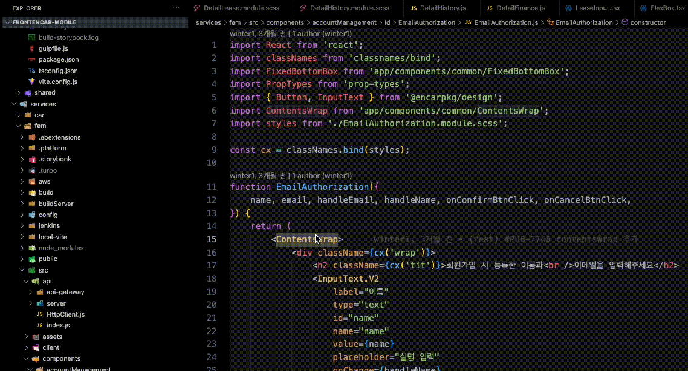

# Encar Extension

# 🚀 FEM에서 로컬vite환경 사용
### 사용방법: F1 -> 엔카FEM비트설정 -> 선택창 선택
### 주의사항
- 실행 후 커밋 전 반드시 엔카FEM비트끄기 실행하여야한다.
- package.json에 새로운 라이브러리가 추가되는 상황이면 추가를 먼저하고 실행하여야한다.

### vite실행영상

### vite닫는영상

#

# ⚒️ 엔카 폴더 템플릿 파일 생성

### 사용방법: 빈 폴더 생성 후, 우클릭 -> js 또는 ts 입력
### 사용이유: index.js,Component.js,Component.module.scss 3개의 파일을 만들기 번거로웠기 때문에 템플릿 사용함으로써 바로 개발 시작 가능.

             

#

# 👀 className cx() 변환 

### 기본 단축키: cmd+ctrl+z
### 사용이유: 마크업 개발시 classname 자동완성을 사용하여 빠르게 개발후 단축키로 cx("") 한번에 바꿔주기 위함

#

# 🔫 scss파일 정리

### 기본 단축키: cmd+ctrl+x
### 사용이유: "width: 100%" :뒤에 공백을 지워줘요 || .test{width:100%;} -> 끝에 있는;를 지워줘요

#

# 🛸 파일 한번에 찾기
### 기본 단축키: cmd+shift+f
### 사용이유: "app/**/Button" 타입스크립트가 아니면 커맨드+좌클릭으로 찾아 갈 수 없음 & jsx구문에서 해당 컴포넌트 바로 찾아가고 싶을 때
### 사용방법: 찾고자 하는 파일명을 더블 클릭 후 단축키 사용
### 주의사항
- 컴포넌트 이름이 파일이름과 같아야 한다.
- export {} 혹은 as로 바꾼 컴포넌트는 못찾음
- /src로 시작하는 저장소는 모두 사용가능(fem을 타겟으로 만들긴했어요)

#

# 👀 모노레포 패키지 파일 찾기
### 기본 단축키: cmd+shift+d
### 사용이유: "@encarpkg/design" 이러한 경로의 파일은 ctrl+왼쪽마우스클릭으로 한번에 찾아갈 수 없는 문제 때문
### 사용방법: 찾고자 하는 파일명을 더블 클릭 후 단축키 사용
### 참고: 중복된 파일명이 존재할 경우 프롬프트 창으로 선택 가능 & 단축키다름 주의(root경로,성능때문에 단축키를 분리함)

#

## 주의사항
### 테스트 코드 실행, 디버깅은 node버전 18이상으로 올리고 실행해야 해요
### 추가하고 싶은 익스텐션 만들고 굳이 테스트코드 작성 안해도 돼요