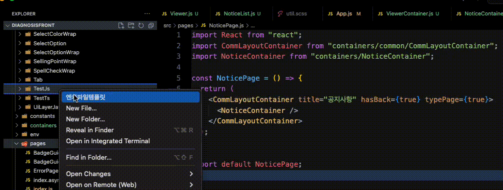
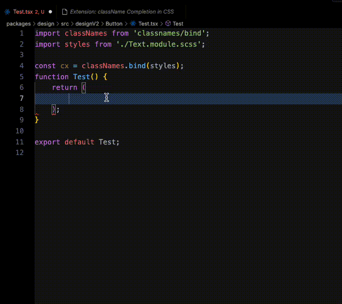
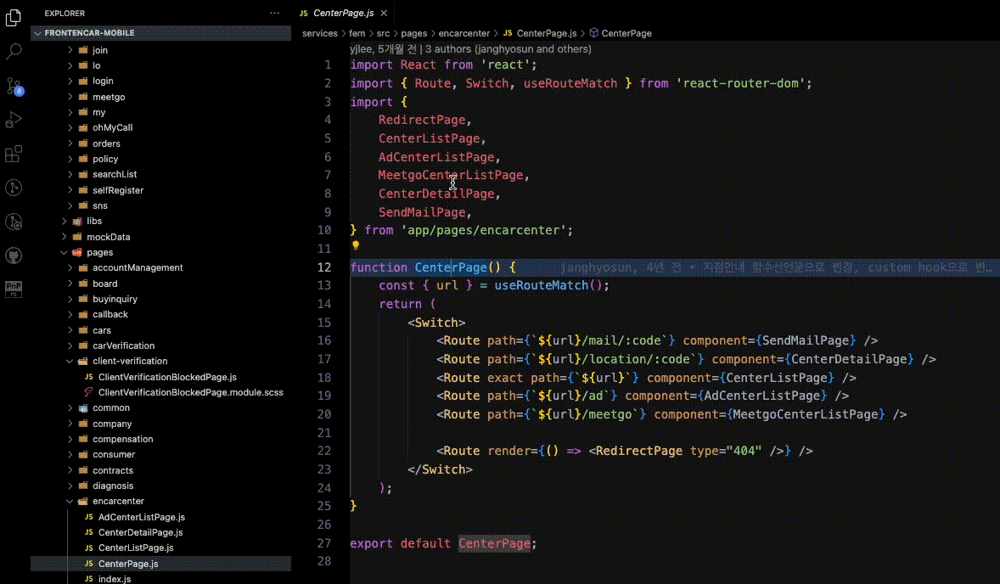
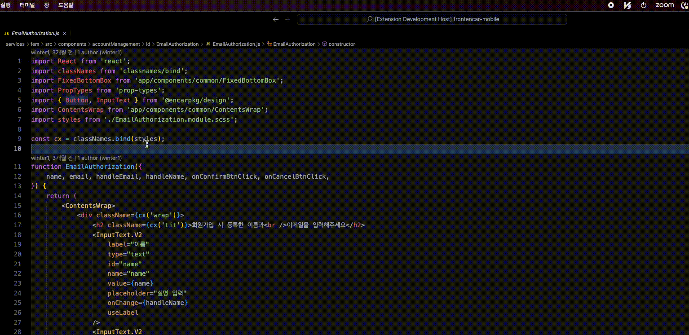

# Encar Extension

## 엔카 폴더 템플릿 파일 생성

### 빈 폴더 생성 후, 우클릭 -> js 또는 ts 입력

## className cx() 변환 

### 기본 단축키: cmd+ctrl+z 또는 F1 -> 스타일바인딩포멧

## className cx() 변환 

### 기본 단축키: cmd+ctrl+x 또는 F1 -> scss파일정리
### 사용이유: "width: 100%" :뒤에 공백을 지워줘요 & .test{width:100%;} -> 끝에 있는;를 지워줘요

## fem 파일 찾기
### 기본 단축키: cmd+shift+f
### 사용이유: "app/Text" 이러한 경로의 파일은 ctrl+왼쪽마우스클릭으로 한번에 찾아갈 수 없는 문제 때문
### 사용방법: 찾고자 하는 파일명을 더블 클릭 후 단축키 사용
### 참고: 중복된 파일명이 존재할 경우 프롬프트 창으로 선택 가능 & fem과 같은 구조의 js저장소라면 사용가능 (대표 예:모바일진단)

## 모노레포 패키지 파일 찾기
### 기본 단축키: cmd+shift+d
### 사용이유: "@encarpkg/design" 이러한 경로의 파일은 ctrl+왼쪽마우스클릭으로 한번에 찾아갈 수 없는 문제 때문
### 사용방법: 찾고자 하는 파일명을 더블 클릭 후 단축키 사용
### 참고: 중복된 파일명이 존재할 경우 프롬프트 창으로 선택 가능 & 단축키다름 주의(root경로,성능때문에 단축키를 분리함)

## 주의사항
### 테스트 코드 작성 후 node버전 18이상으로 올리고 실행해야 해요
### 추가하고 싶은 익스텐션 만들고 굳이 테스트코드 작성 안해도 돼요